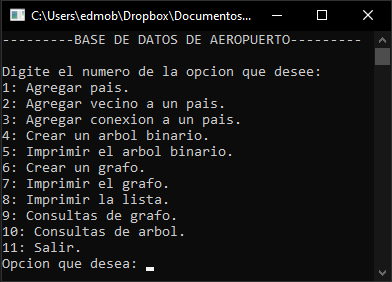

# Airport
Console application that represents an airport using a graph or a binary search tree (BST).

## Operations
1. Add country.
2. Add neighboring country.
3. Add country connection.
4. Create a binary search tree.
5. Print the binary search tree.
6. Create a graph.
7. Print the graph.
8. Print the list.
9. *Not implmeneted*.
10. *Not implmeneted*.
11. Exit.

## GUI
